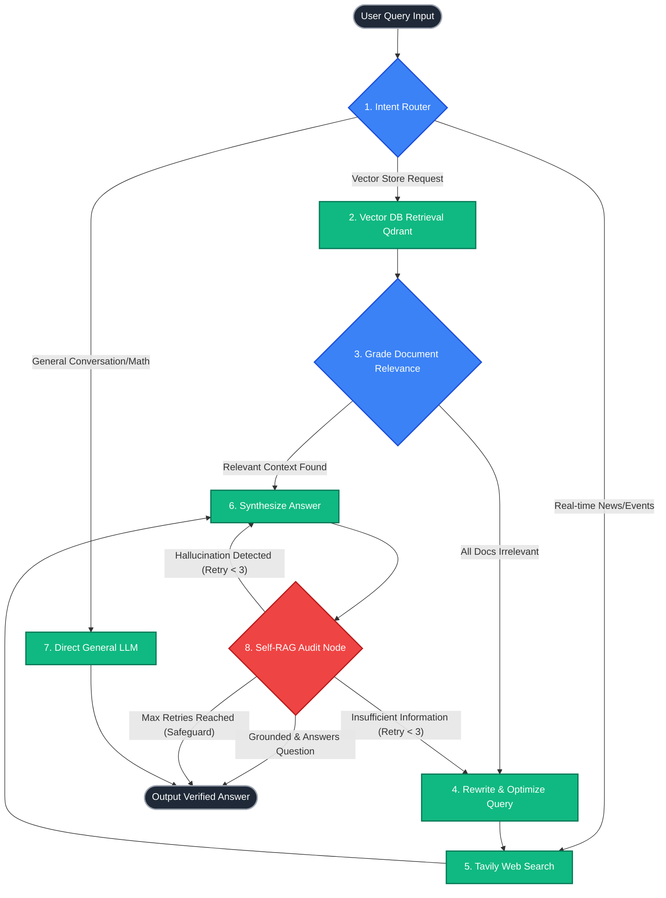

# ⚡ Adaptive Agentic RAG Engine
> **Production-Grade Self-Corrective RAG System built using LangGraph Multi-Agent Workflows, Qdrant, & FastAPI**

[](https://www.python.org/downloads/)
[](https://github.com/langchain-ai/langgraph)
[](https://qdrant.tech/)
[](https://fastapi.tiangolo.com/)
[](https://opensource.org/licenses/MIT)

An intelligent, self-correcting Retrieval-Augmented Generation (RAG) system designed to solve common production RAG failures (hallucinations, retrieval irrelevance, and static query routing).

Unlike standard naive RAG pipelines that unconditionally fetch vector embeddings, this engine dynamically routes queries, evaluates context relevance, rewrites low-performing queries, falls back to real-time web search when context is missing, and performs automated self-correction before outputting answers.

---

## 🎯 Executive Summary (For Recruiters & Tech Leads)

Traditional RAG suffers from **two major flaws**:
1. **Retrieval Blindness:** It always queries the vector DB even for general greetings (`"hi"`) or current events (`"latest tech news"`).
2. **Hallucination Blindness:** It trusts the generator blindly, returning false statements if retrieved context is noisy or incomplete.

This system solves these issues using an **Agentic State Graph Architecture (LangGraph)** combining principles from **Corrective RAG (CRAG)** and **Self-RAG**.

---

## 🏗️ System Architecture & Workflow Diagram

GitHub renders standard Mermaid flowcharts directly in your browser. Below is the precise state machine driving this system:



---

## 🔥 Key Technical Highlights & Innovation

### 1. 🔀 Adaptive Intent Routing
Instead of executing vector similarity searches indiscriminately, an **LLM Intent Router** enforces structured Pydantic routing:
- **Vector DB (`vectorstore`):** Queries seeking domain-specific knowledge, code specs, or technical facts.
- **Web Search (`websearch`):** Real-time web requests (live sports, news, stock quotes).
- **Direct LLM (`general`):** Basic conversational chit-chat (`"hello"`, `"who are you"`) and basic calculations.

### 2. 🛡️ Corrective RAG (CRAG) & Web Fallback
If retrieved document chunks fail binary relevance grading, the engine automatically triggers a **Query Rewriter node**, optimizing search syntax and invoking **Tavily Web Search** to retrieve external ground-truth facts.

### 3. 🔍 Self-RAG Audit Node & Infinite Loop Prevention
Generated answers undergo a single-pass dual audit:
1. **Faithfulness / Groundedness Check:** Verifies if answer claims are supported by facts.
2. **Answer Relevance Check:** Verifies if the answer actually answers the user's question.

* **Loop Safeguard:** Implements stateful `retry_count` bounds. If self-correction fails 3 consecutive times, execution terminates cleanly to prevent API token drain.

### 4. 📊 Observability & Quantitative Benchmarking
- **LangSmith Tracing:** Full execution node latency, input/output traces, and token consumption graphs.
- **Ragas Benchmarking (`eval_ragas.py`):** Quantitative offline evaluation tracking *Faithfulness* and *Answer Relevance* scores exported directly to pandas/CSV.

---

## 🛠️ Tech Stack & Key Libraries

| Component | Technology Used | Rationale |
| :--- | :--- | :--- |
| **Agent Orchestration** | **LangGraph** | Enables stateful graphs, conditional branching, and cycle loops. |
| **LLM Provider** | **Groq Cloud (`llama-3.3-70b-versatile`)** | Sub-second ultra-low latency inference with zero cost. |
| **Vector Database** | **Qdrant** | High-performance vector index with payload filtering support. |
| **Embeddings** | **HuggingFace (`all-MiniLM-L6-v2`)** | 384-dimensional dense local embeddings. |
| **Web Search Fallback** | **Tavily API** | Search tool optimized for LLM RAG pipelines. |
| **API Backend** | **FastAPI + Uvicorn** | Async REST endpoints serving graph state requests. |
| **Evaluation & Tracing** | **Ragas + LangSmith** | Industrial RAG metrics and execution tracing. |

---

## 🚀 Quickstart Guide

### 1. Clone & Setup Environment
```bash
git clone https://github.com/Armaan-lite/Adaptive-Agentic-RAG-Engine.git
cd Adaptive-Agentic-RAG-Engine

# Create virtual environment
python -m venv .venv
# On Windows: .venv\Scripts\activate
# On Linux/macOS: source .venv/bin/activate

pip install -r requirements.txt
```

### 2. Configure Environment Variables
Copy `.env.example` to `.env` and insert your API keys:
```bash
cp .env.example .env
```
```env
GROQ_API_KEY=gsk_your_groq_key
TAVILY_API_KEY=tvly-your_tavily_key
LANGCHAIN_TRACING_V2=true
LANGCHAIN_API_KEY=lsv2_your_langsmith_key
LANGCHAIN_PROJECT=adaptive-rag-engine
```

### 3. Run FastAPI Backend & Streamlit UI
```bash
# Terminal 1: Run API Backend
uvicorn src.api.main:app --reload

# Terminal 2: Run Streamlit Demo UI
streamlit run streamlit_app/app.py
```

### 4. Run Test Suite & Evaluation Benchmark
```bash
# Run unit tests (Graph Compilation & Retry Limits)
python test_engine.py

# Run Ragas Evaluation Benchmark
python eval_ragas.py
```

---

## 📜 License
Distributed under the MIT License. See `LICENSE` for details.
